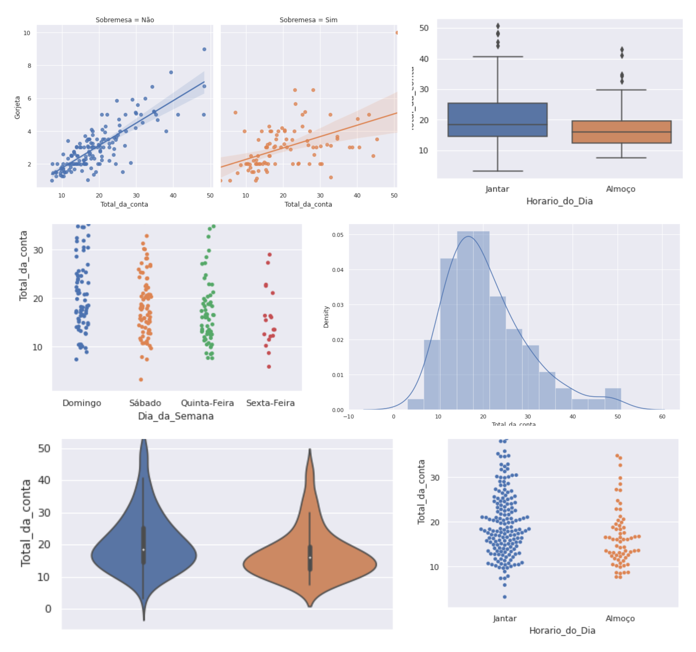

# Tip_Data_Sample 

## Why?

This project is part of my personal portfolio, so any feedback or suggestion that may contribute to my growth as a Data Scientist will be very welcome.

## Used packages:
- [Pandas](https://pandas.pydata.org/docs/) - For data manipulation
- [Matplotlib](https://matplotlib.org/) - For data visualization (graph plot)
- [Seaborn](https://seaborn.pydata.org/) - For data visualization (custom graphics plot)
- [scipy](https://docs.scipy.org/doc/) - For the use of statistical methods such as Hypothesis Testing.

## Project description:

Based on a tip data sample from other countries where there is no flat-rate we will evaluate four topics:

- 1 - If the bill value influences the tip value and if this increase is proportional
- 2 - Check the difference between the tip values of those who ordered and did not order dessert
- 3 - Check if the week's day changes the tip value
- 4 - Check the day's time that tip is higher 
--------------------------------------------------------------------------------------------------------------------------------------------------------------------------------
**Sobre o projeto (pt-BR 🇧🇷).**

## Bibliotecas utilizadas no projeto:
- [Pandas](https://pandas.pydata.org/docs/) - Para manipulação dos dados
- [Matplotlib](https://matplotlib.org/) - Para visualização dos dados (plot de gráficos)
- [Seaborn](https://seaborn.pydata.org/) - Para visualização dos dados (plot de gráficos customizados)
- [scipy](https://docs.scipy.org/doc/) - Para utilização de métodos estatísticos como Teste de Hipótese

## Descição do projeto:

Com base em uma amostra de dados de gorjetas de outros países, onde não existe uma taxa fixa, vamos avaliar quatro tópicos:

- 1 - Se o valor da conta influência no valor da gorjeta e se esse aumento é proporcional
- 2 - Verificar a diferença de valores das gorjetas de quem pediu e quem não pediu sobremesa
- 3 - Verificar se o dia da semana interfere no valor da gorjeta
- 4 - Verificar em qual hora do dia a gorjeta é maior
